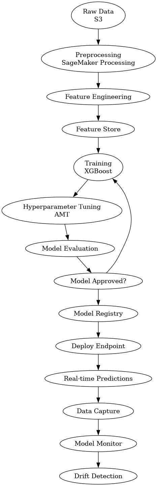

# 🚀 E-commerce Order Delay Prediction (MLOps with SageMaker)

## 📌 Project Overview
This project is a hands-on MLOps implementation to predict whether an e-commerce order will be delivered late. It demonstrates how to build, train, deploy, and monitor a machine learning model using AWS SageMaker.

---

## 🧠 Problem Statement
In e-commerce operations, delayed deliveries impact customer satisfaction and logistics efficiency.  
This project aims to predict **late deliveries in advance** using historical order and operational data.

---

## ⚙️ Solution Approach
- Built a **binary classification model** (late vs on-time delivery)
- Designed an **end-to-end MLOps pipeline**
- Automated training, tuning, evaluation, and deployment using SageMaker

---

## 🏗️ Architecture

Key workflow:

1. Data stored in **Amazon S3**
2. Data preprocessing using **SageMaker Processing**
3. Feature storage using **SageMaker Feature Store**
4. Model training & tuning using **XGBoost + AMT**
5. Pipeline orchestration using **SageMaker Pipelines**
6. Model deployment to **real-time endpoint**
7. Monitoring with **SageMaker Model Monitor**

---

## 🛠️ Tech Stack
- AWS S3  
- AWS SageMaker (Pipelines, Feature Store, Model Monitor)  
- XGBoost  
- Python  

---

## 📂 Project Structure
